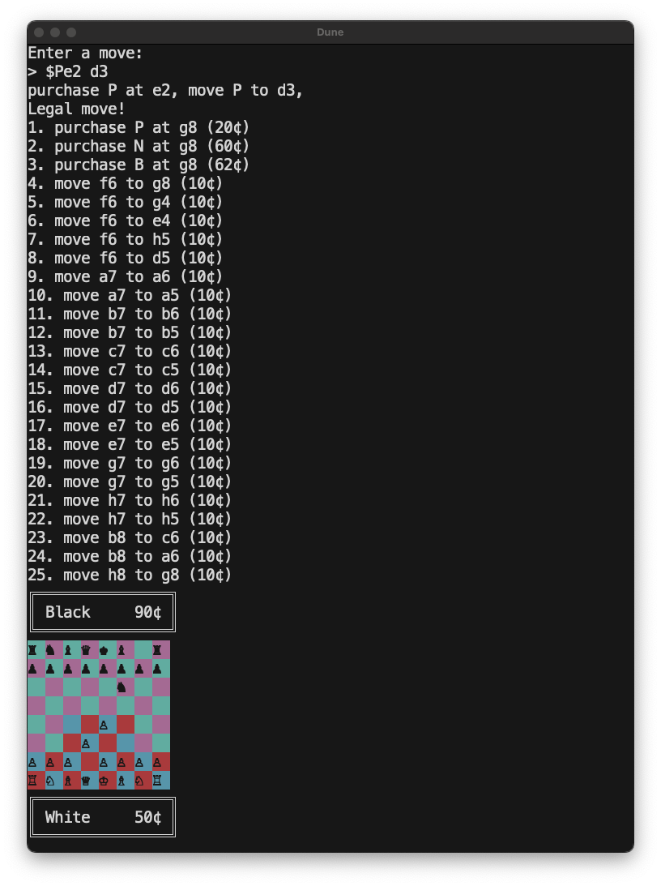

# State Capitalist Chess


This repository implements chess but with a state-capitalist twist. The game is played on a traditional chess board with traditional chess pieces.

## Rules

The rules are the same as in traditional chess, with the following exceptions:
1. The game is played by two players, each representing their own nation-state.
2. Each nation-state has a national bank, which is used to fund the war effort.
    - Nation-states start with a base amount of currency **(measured in 1¢ pennies or 10¢ doubloons)**.
    - Nation-states receive additional currency at the end of their turn based on their controlled territory, measured by the number of 2x2 "sectors" they control. The four center sectors are each worth 2 doubloons per turn (20¢), and the remaining 12 sectors are each worth 1 doubloon per turn (10¢).
3. Nation-states can use their currency to purchase additional pieces, which must be purchased on their two "home rows" (rows 1 and 2 for white, rows 7 and 8 for black).
4. Nation-states may play multiple moves per turn, *for an exponential cost*.
    - Each move has a base cost of 1 doubloon, and each additional move accrues interest at a rate of 200%. For example, the first move costs 1 doubloon, the second move costs 2 doubloons, the third move costs 4 doubloons, and so on.
    - These moves may can be used to move pieces, capture enemy pieces, or purchase new pieces.
5. A nation-state may not purchase pieces while they are in check.

|Piece Type|Cost|
|---|---|
|Pawn ♟︎|2 doubloons|
|Knight ♞|6 doubloons|
|Bishop ♝|6.3 doubloons|
|Rook ♜|10 doubloons|
|Queen ♛|18 doubloons|
|King ♚|200 doubloons|

6. The game ends when a nation-state has no legal moves remaining. This occurs when:
    - The nation-state's king is in checkmate.
    - The nation-state has no pieces remaining.
    - The nation-state is bankrupt and can no longer afford the war effort.

## Setup

To play the game, clone the repository and run the following command:

```bash
cargo run --release
```

This will start a game with the default settings, playing against a greedy capitalist AI with a move depth of 4.



### Controls

Moves can be entered in algebraic notation. For example, to move the pawn at e2 to e4, you would enter `e2e4`. You can also enter just `e4` to allow the engine to infer which pawn to move.

To purchase a piece, enter `$` followed by the piece type and the square to place the piece. For example, to purchase a knight on e1, you would enter `$Ne1`.

To play multiple moves in order, separate the moves with a space. For example, to move the pawn at e2 to e4 and then purchase a knight on e1, you would enter `e2e4 $Ne1`.

## Usage as a Library

You can write your own interface to the game engine by using it as a library. Here's an example program which does this.

```rust
use capitalist_chess::*;
use std::{str::FromStr, io::{stdin, stdout, Write}};

fn main() {
    let mut board = StateCapitalistBoard::default();

    // Loop and read moves from stdin
    loop {
        let legal_moves = SimpleEngine.legal_moves(&board);
        for (i, legal_move) in legal_moves.iter().enumerate() {
            let cost = board.get_bank(board.whose_turn()).get_market().get_move_value(legal_move);
            println!("{i}. {legal_move:?} ({cost})", i=i+1);
        }
        println!("{board}");

        if board.whose_turn() == Color::Black {
            eprintln!("Engine is thinking...");
            let result = SimpleEngine.best_move(&board).unwrap();
            println!("Engine move: {result:?}");
            board.apply(result).unwrap();
            continue;
        }

        print!("Enter a move:\n> ");
        // Flush stdout
        stdout().flush().unwrap();
        
        let mut input = String::new();
        stdin().read_line(&mut input).unwrap();
        let input = input.trim();

        if input == "exit" {
            break;
        }


        if let Ok(player_move) = Move::from_str(input) {
            println!("{player_move:?}");
            if board.is_legal_move(&player_move) {
                println!("Legal move!");
            } else {
                println!("Illegal move!");
                continue;
            }

            if board.apply(player_move).is_err() {
                println!("Illegal move!");
            }
        } else {
            println!("Invalid move!");
        }
    }
}
```

## License

This project is licensed under the MIT License - see the [LICENSE](LICENSE) file for details.